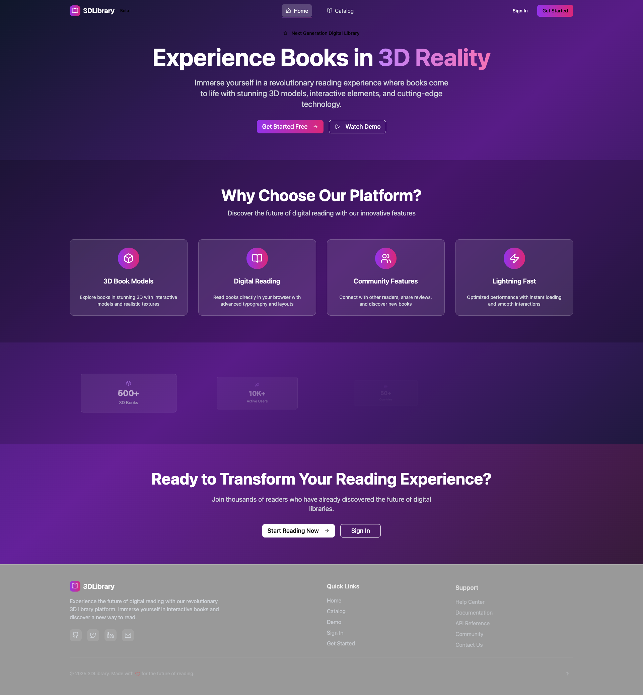

# 🚀 3D Library - Next Generation Digital Reading Platform

Experience the future of digital reading with our revolutionary 3D library platform. Immerse yourself in interactive books with stunning 3D models, advanced animations, and cutting-edge technology.


## ✨ Features

### 🎨 **Stunning Visual Design**
- **Glassmorphism UI**: Modern glass-like effects with backdrop blur
- **Gradient Backgrounds**: Beautiful purple-to-pink gradients throughout
- **Smooth Animations**: Framer Motion powered animations and transitions
- **Responsive Design**: Perfect on desktop, tablet, and mobile devices

### 🎮 **Interactive 3D Experience**
- **3D Book Models**: Explore books in stunning 3D with realistic textures
- **Interactive Controls**: Zoom, rotate, and pan with intuitive controls
- **Auto-rotation**: Watch books rotate automatically with smooth animations
- **Sparkle Effects**: Magical particle effects around 3D models
- **Floating Animation**: Subtle floating motion for immersive experience

### 🔍 **Advanced Search & Discovery**
- **Real-time Search**: Instant search results as you type
- **Smart Filtering**: Filter by category, availability, and more
- **Sort Options**: Sort by title, author, date, and popularity
- **Pagination**: Smooth pagination for large catalogs

### 👤 **User Experience**
- **Authentication**: Secure JWT-based authentication
- **User Profiles**: Personalized user profiles and preferences
- **Admin Dashboard**: Powerful admin panel for content management
- **Responsive Navigation**: Beautiful animated navigation with glassmorphism

### 🚀 **Performance & Technology**
- **React 18**: Latest React features with concurrent rendering
- **TypeScript**: Full type safety and better developer experience
- **Django REST API**: Robust backend with Django and DRF
- **Three.js**: Industry-standard 3D graphics library
- **Framer Motion**: Professional animations and micro-interactions

## 🛠️ Tech Stack

### Frontend
- **React 18** - Modern React with hooks and concurrent features
- **TypeScript** - Type-safe development
- **Vite** - Lightning-fast build tool
- **Tailwind CSS** - Utility-first CSS framework
- **Framer Motion** - Production-ready motion library
- **Three.js** - 3D graphics library
- **React Three Fiber** - React renderer for Three.js
- **Lucide React** - Beautiful icon library

### Backend
- **Django 5.2** - Latest Django with modern features
- **Django REST Framework** - Powerful API framework
- **Django CORS Headers** - Cross-origin resource sharing
- **Simple JWT** - JWT authentication
- **Django Filter** - Advanced filtering capabilities
- **DRF Spectacular** - API documentation
- **Pillow** - Image processing

### Development Tools
- **ESLint** - Code linting
- **Prettier** - Code formatting
- **TypeScript** - Static type checking
- **Vite** - Fast development server

## 🚀 Quick Start

### Prerequisites
- Node.js 18+ 
- Python 3.11+
- Git

### Installation

1. **Clone the repository**
   ```bash
   git clone https://github.com/yourusername/3d-library.git
   cd 3d-library
   ```

2. **Start the Backend (Django API)**
   ```bash
   cd apps/api
   python3 -m venv .venv
   source .venv/bin/activate  # On Windows: .venv\Scripts\activate
   pip install -r requirements.txt
   python manage.py runserver
   ```

3. **Start the Frontend (React App)**
   ```bash
   cd apps/web
   npm install
   npm run dev
   ```

4. **Open your browser**
   - Frontend: http://localhost:5173
   - Backend API: http://localhost:8000
   - Admin Panel: http://localhost:8000/admin

## 📱 Screenshots

### Homepage


*Additional screenshots coming soon...*

## 🎯 Key Features in Detail

### 🎨 **Modern UI/UX**
- **Glassmorphism Design**: Translucent glass-like elements with backdrop blur
- **Gradient Backgrounds**: Beautiful purple-to-pink gradients
- **Smooth Animations**: 60fps animations powered by Framer Motion
- **Micro-interactions**: Hover effects, button animations, and transitions
- **Dark Theme**: Eye-friendly dark theme with proper contrast

### 🎮 **3D Interactive Features**
- **Realistic 3D Models**: High-quality GLB/GLTF models with textures
- **Interactive Controls**: Intuitive mouse and touch controls
- **Auto-rotation**: Smooth automatic rotation with play/pause controls
- **Zoom Controls**: Dynamic zoom in/out functionality
- **Sparkle Effects**: Magical particle effects for visual appeal
- **Floating Animation**: Subtle floating motion for immersion

### 🔍 **Advanced Search & Discovery**
- **Debounced Search**: Optimized search with debouncing
- **Real-time Results**: Instant search results as you type
- **Smart Filters**: Multiple filter options (category, availability, etc.)
- **Sort Options**: Multiple sorting criteria
- **Pagination**: Smooth pagination with loading states

### 👤 **User Management**
- **JWT Authentication**: Secure token-based authentication
- **User Profiles**: Personalized user experience
- **Admin Panel**: Comprehensive admin dashboard
- **Role-based Access**: Different permissions for users and admins

## 🏗️ Project Structure

```
3d-library/
├── apps/
│   ├── api/                 # Django REST API
│   │   ├── catalog/         # Book catalog management
│   │   ├── circulation/     # Book borrowing system
│   │   ├── users/          # User management
│   │   └── core/           # Django settings
│   └── web/                # React frontend
│       ├── src/
│       │   ├── components/ # Reusable UI components
│       │   ├── features/   # Feature-based modules
│       │   ├── shared/     # Shared utilities and hooks
│       │   └── app/        # App configuration
│       └── public/         # Static assets
├── docs/                   # Documentation
└── infra/                  # Infrastructure configs
```

## 🚀 Deployment

### Frontend (Vercel/Netlify)
```bash
cd apps/web
npm run build
# Deploy the dist folder
```

### Backend (Railway/Heroku)
```bash
cd apps/api
# Configure environment variables
# Deploy using your preferred platform
```

## 🤝 Contributing

1. Fork the repository
2. Create a feature branch (`git checkout -b feature/amazing-feature`)
3. Commit your changes (`git commit -m 'Add amazing feature'`)
4. Push to the branch (`git push origin feature/amazing-feature`)
5. Open a Pull Request

## 📄 License

This project is licensed under the MIT License - see the [LICENSE](LICENSE) file for details.

## 🙏 Acknowledgments

- **Three.js** - For amazing 3D graphics capabilities
- **Framer Motion** - For smooth animations
- **Tailwind CSS** - For beautiful styling
- **Django** - For robust backend framework
- **React** - For amazing frontend framework

## 📞 Support

- **Email**: contact@3dlibrary.com
- **Discord**: [Join our community](https://discord.gg/3dlibrary)
- **Documentation**: [Read the docs](https://docs.3dlibrary.com)

---

⭐ **Star this repository if you find it helpful!**

Made with ❤️ for the future of digital reading.
# 3dLibrary
